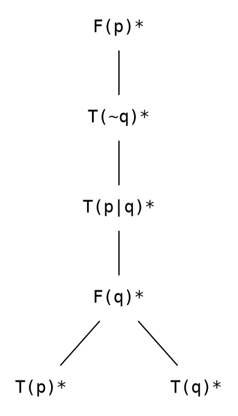
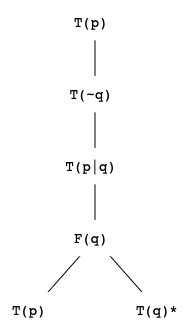
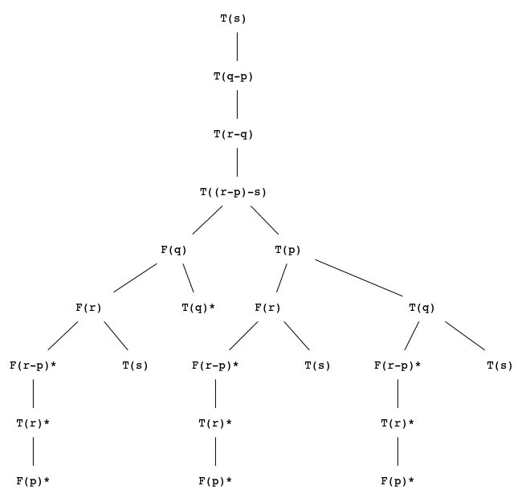
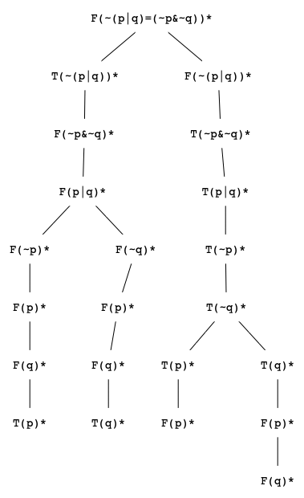

# Tableaux SAT

SAT solver based on tableaux method.

## Install

To compile the sources makefile, which is present in the repository, can be used. The executable will be placed in a build directory: `build/tableaux-sat`

## Manual

`tableaux-sat [-T] [--dot]`

### <a name="sat"></a>1. Satisfiability of a Formula

Input format: a formula must consist of valid [connectives](#connectives) and propositional letters. a propositional letter can contain alphanumeric characters. Letters and proposition can be separated by spaces (they will be removed).

Program will output the satisfiability (`SATISFIABLE` or `UNSATISFIABLE`) on the first line and a model (if it exists).If the formula is satisfiable the next lines contain the model in following format

`<propositional_letter> = <0 or 1>`

If some of the propositional letters in the formula is not present in the output, it means that its value is independent.
The leftmost non-contradictory branch of the tableau is taken as a model.

[See an example](#example-1)

### 2. Satisfiability of a Theory

Theory mode is enabled by option `-T`.

Input format: Each formula is on separate line. The first line contains a formula to prove in the theory. Following line contain axioms of the theory.
The output is in the same format as in [the first part](#sat).

[See an example](#example-2)

### 3. Dot Language Output

[See an example](#example-3)

### 4. Tableaux Proofs

[See an example](#example-4)

## <a name="connectives"></a>Connectives

| Symbol | Connective | Priority |
| :----: | :--------: | :------: |
|  `~`   |  not (¬)   |    1     |
|  `&`   |  and (∧)   |    2     |
|  `\|`  |   or (∨)   |    2     |
|  `-`   |   if (→)   |    3     |
|  `=`   |  iff (↔)   |    3     |

Priority can be modified using parantheses `(`, `)`.

## Examples

Input format:

### <a name="example-1"></a>1. Satisfiability of a Formula

```txt
$ tableaux-sat
p & ~p
```

```txt
UNSATISFIABLE
```

### <a name="example-2"></a>2. Satisfiability of a Theory

```txt
$ tableaux-sat -T
s
q - p
r - q
(r - p) - s
```

```txt
SATISFIABLE
q = 0
r = 0
s = 1
```

### <a name="example-3"></a>3. Dot Language Output

```txt
$ tableaux-sat -T --dot
p
~q
p | q
```



Image generated from the output by [graphviz](https://www.graphviz.org/):



Note that nodes on contradictory branches are marked by an asterisk.

### <a name="example-4"></a>4. Tableaux Proofs

```txt
$ tableaux-sat --proof
~(p | q) = (~p & ~q)
```

```txt
PROVABLE
```

### Tableaux from Prevoius Examples

Tableau from example 2:



Tableau from example 4:


