# Tableaux SAT

SAT solver based on tableaux method

- [Install](#install)
- [Manual](#manual)
- [Examples](#examples)

## Tableaux Method

Following part contains basic definitions for those unfamiliar with the tableaux method.

A tableau is a labeled binary tree. The nodes of this tree are called _entries_. Each entry is labeled with a signed propositions (i.e. proposition preceded by either a _T_ or an _F_).

A tableau proof of a proposition _A_ is a contradictory tableau with root entry _F(A)_. A tableau refutation for a proposition _A_ is a contradictory tableau with root entry _T(A)_

Entry _E_ has been reduced on _P_ if all the entries on one path through the atomic tableau with root _E_ occur on _P_.

Atomic tableaux:

|                                                            |                                                            |                                                            |                                                            |
| :--------------------------------------------------------: | :--------------------------------------------------------: | :--------------------------------------------------------: | :--------------------------------------------------------: |
| 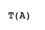 | 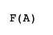 | 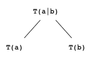 | 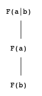 |
| 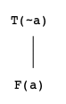 | 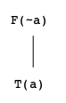 | 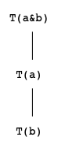 | 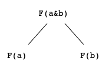 |
|  |  | 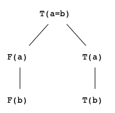 | 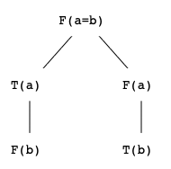 |

A tableau can be constructed inductively:

1. Every atomic tableau is a tableau
2. If _T_ is a tableau and _E_ is an entry of _T_ of maximal depth such that there is a noncontradictory path _P_ of _T_ on which _E_ is unreduced, then if _T'_ is the tableau gotten by adjoining the unique atomic tableau with root E to the end of every noncontradictory path _P'_ of _T_ on which _E_ is unreduced, then _T'_ is a tableau.

**Reference:**

Nerode, A., & Shore, R. A. (1997). _Logic for applications_. New York: Springer.

## <a name="install"></a>Install

To compile the sources a makefile, which is present in the repository, can be used. The executable will be placed in a build directory: `build/tableaux-sat`

## <a name="manual"></a>Manual

`tableaux-sat [-Tdp] [--dot] [--proof]`

### <a name="sat"></a>1. Satisfiability of a Formula

Input format: a formula must consist of valid [connectives](#connectives) and propositional letters. a propositional letter can contain alphanumeric characters. Letters and proposition can be separated by spaces (they will be removed).

Program will output the satisfiability (`SATISFIABLE` or `UNSATISFIABLE`) on the first line and a model (if it exists).If the formula is satisfiable the next lines contain the model in following format

`<propositional_letter> = <0 or 1>`

If some of the propositional letters in the formula is not present in the output, it means that its value is independent.
The leftmost non-contradictory branch of the tableau is taken as a model.

[See an example](#example-1)

### 2. Satisfiability of a Theory

Theory mode is enabled by option `-T`.

Input format: Each formula is on separate line. The first line contains a formula to prove in the theory. Following line contain axioms of the theory. These axioms will be signed with _T_.
The output is in the same format as in [the first part](#sat).

[See an example](#example-2)

### 3. Dot Language Output

The program will output the tableau in the dot language format when `-d` or `--dot` options are set. The output can be used with a program such as [graphviz](https://www.graphviz.org/) to generate an image.

Contradictory branches are marked with an astersisk `*`.

[See an example](#example-3)

### 4. Tableaux Proofs

Proof mode can be set with options `-p` or `--proof`. In proof mode the root entry will be signed with _F_.

[See an example](#example-4)

### <a name="connectives"></a>5. Connectives

| Symbol | Connective | Priority |
| :----: | :--------: | :------: |
|  `~`   |  not (¬)   |    3     |
|  `&`   |  and (∧)   |    2     |
|  `\|`  |   or (∨)   |    2     |
|  `-`   |   if (→)   |    1     |
|  `=`   |  iff (↔)   |    1     |

Priority can be modified using parantheses `(`, `)`.

## <a name="examples"></a>Examples

All examples can be executed by running `demo.sh`.

### <a name="example-1"></a>1. Satisfiability of a Formula

```txt
$ tableaux-sat
p & ~p
```

```txt
UNSATISFIABLE
```

### <a name="example-2"></a>2. Satisfiability of a Theory

```txt
$ tableaux-sat -T
s
q - p
r - q
(r - p) - s
```

```txt
SATISFIABLE
q = 0
r = 0
s = 1
```

### <a name="example-3"></a>3. Dot Language Output

```txt
$ tableaux-sat -T --dot
p
~q
p | q
```

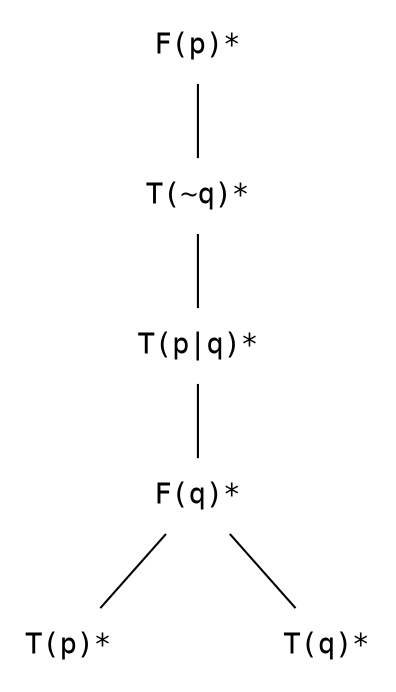

Image generated from the output by [graphviz](https://www.graphviz.org/):

<p align="center">
        
</p>

Note that nodes on contradictory branches are marked by an asterisk.

### <a name="example-4"></a>4. Tableaux Proofs

```txt
$ tableaux-sat --proof
~(p | q) = (~p & ~q)
```

```txt
PROVABLE
```

### Tableaux from Prevoius Examples

Tableau from example 2:

<p align="center">

</p>

Tableau from example 4:

<p align="center">

</p>
